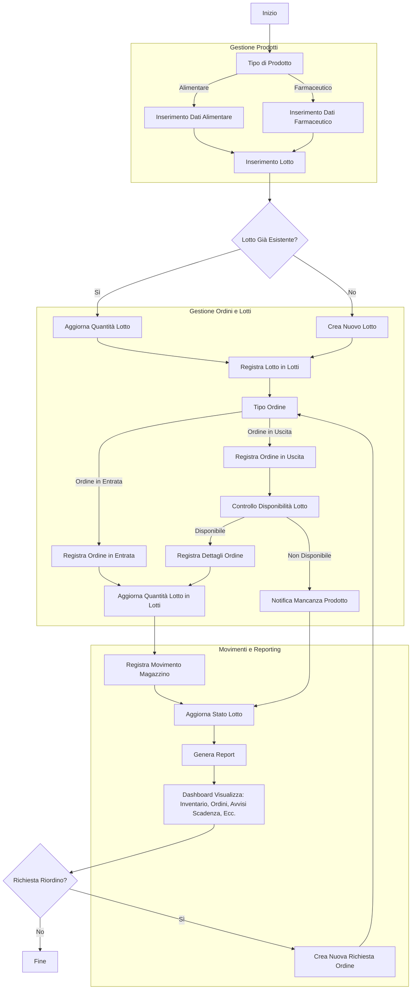

```mermaid
flowchart TD
 subgraph subGraph0["Gestione Prodotti"]
        B["Tipo di Prodotto"]
        C["Inserimento Dati Alimentare"]
        D["Inserimento Dati Farmaceutico"]
        E["Inserimento Lotto"]
  end
 subgraph subGraph1["Gestione Ordini e Lotti"]
        K["Tipo Ordine"]
        L["Registra Ordine in Entrata"]
        M["Registra Ordine in Uscita"]
        O["Controllo Disponibilità Lotto"]
        P["Registra Dettagli Ordine"]
        Q["Notifica Mancanza Prodotto"]
        R["Aggiorna Quantità Lotto in Lotti"]
        H["Aggiorna Quantità Lotto"]
        I["Crea Nuovo Lotto"]
        J["Registra Lotto in Lotti"]
  end
 subgraph subGraph2["Movimenti e Reporting"]
        S["Registra Movimento Magazzino"]
        T["Aggiorna Stato Lotto"]
        U["Genera Report"]
        V["Dashboard Visualizza: Inventario, Ordini, Avvisi Scadenza, Ecc."]
        Y["Crea Nuova Richiesta Ordine"]
  end
    A["Inizio"] --> B
    B -- Alimentare --> C
    B -- Farmaceutico --> D
    C --> E
    D --> E
    E --> G{"Lotto Già Esistente?"}
    G -- Sì --> H
    G -- No --> I
    H --> J
    I --> J
    J --> K
    K -- Ordine in Entrata --> L
    K -- Ordine in Uscita --> M
    L --> R
    M --> O
    O -- Disponibile --> P
    O -- Non Disponibile --> Q
    P --> R
    R --> S
    S --> T
    Q --> T
    T --> U
    U --> V
    V --> X{"Richiesta Riordino?"}
    X -- Sì --> Y
    Y --> K
    X -- No --> Z["Fine"]
    K@{ shape: rect}
```