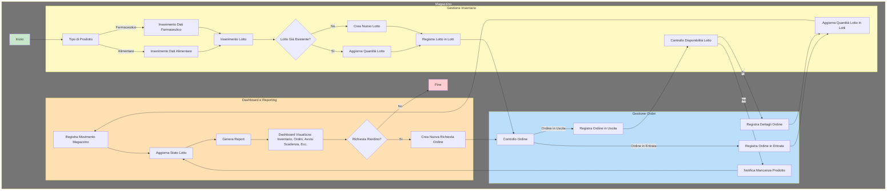

```mermaid
flowchart TD
 subgraph subGraph0["Gestione Inventario"]
        B["Tipo di Prodotto"]
        C["Inserimento Dati Alimentare"]
        D["Inserimento Dati Farmaceutico"]
        E["Inserimento Lotto"]
        R["Aggiorna Quantità Lotto in Lotti"]
        H["Aggiorna Quantità Lotto"]
        I["Crea Nuovo Lotto"]
        J["Registra Lotto in Lotti"]
        G{"Lotto Già Esistente?"}
        O["Controllo Disponibilità Lotto"]
  end
 subgraph subGraph1["Gestione Ordini"]
        P["Registra Dettagli Ordine"]
        Q["Notifica Mancanza Prodotto"]
        K["Controllo Ordine"]
        L["Registra Ordine in Entrata"]
        M["Registra Ordine in Uscita"]
  end
 subgraph subGraph2["Dashboard e Reporting"]
        S["Registra Movimento Magazzino"]
        T["Aggiorna Stato Lotto"]
        U["Genera Report"]
        V["Dashboard Visualizza: Inventario, Ordini, Avvisi Scadenza, Ecc."]
        Y["Crea Nuova Richiesta Ordine"]
        X{"Richiesta Riordino?"}
  end
 subgraph subgraph00["Magazzino"]
        subGraph0
        subGraph2
        subGraph1
        A["Inizio"]
        Z["Fine"]
  end
    A --> B
    B -- Alimentare --> C
    B -- Farmaceutico --> D
    C --> E
    D --> E
    E --> G
    G -- Sì --> H
    G -- No --> I
    H --> J
    I --> J
    J --> K
    K -- Ordine in Entrata --> L
    K -- Ordine in Uscita --> M
    O -- Si --> P
    O -- No --> Q
    L --> R
    M --> O
    P --> R
    R --> S
    S --> T
    Q --> T
    T --> U
    U --> V
    V --> X
    X -- Sì --> Y
    X -- No --> Z
    Y --> K
    style subGraph0 fill:#FFF9C4
    style subGraph1 fill:#BBDEFB
    style subGraph2 fill:#FFE0B2
    style A fill:#C8E6C9
    style Z fill:#FFCDD2
    style subgraph00 fill:#757575,color:#FFFFFF

```