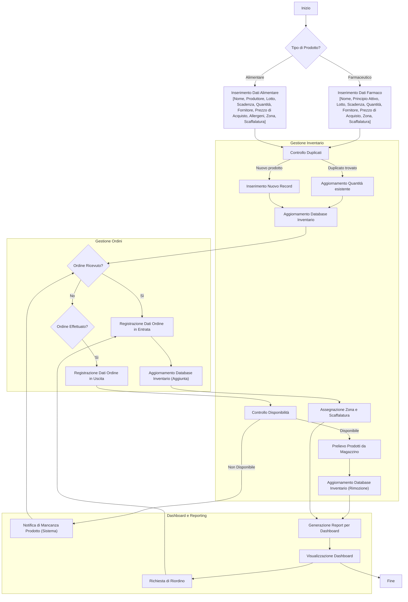

# Magazzino

```mermaid
graph TD
    A["Inizio"] --> B{"Tipo di Prodotto?"};
    B -- Farmaceutico --> C["Inserimento Dati Farmaco<br>[Nome, Principio Attivo, Lotto, Scadenza, Quantità, Fornitore, Prezzo di Acquisto, Zona, Scaffalatura]"];
    B -- Alimentare --> D["Inserimento Dati Alimentare<br>[Nome, Produttore, Lotto, Scadenza, Quantità, Fornitore, Prezzo di Acquisto, Allergeni, Zona, Scaffalatura]"];
    C --> E["Controllo Duplicati (Addetto Magazzino)"];
    D --> E;
    E -- Duplicato trovato --> E1["Aggiornamento Quantità esistente (Addetto Magazzino)"];
    E -- Nuovo prodotto --> E2["Inserimento Nuovo Record (Addetto Magazzino)"];
    E1 --> F;
    E2 --> F;
    F["Aggiornamento Database Inventario"];
    F --> G{"Ordine Ricevuto?"};
    G -- Sì --> H["Registrazione Dati Ordine in Entrata<br>[Fornitore, Data Ordine, Numero Ordine, Prodotti, Quantità] (Addetto Magazzino)"];
    H --> I["Aggiornamento Database Inventario (Aggiunta) (Addetto Magazzino)"];
    I --> I1["Assegnazione Zona e Scaffalatura (Addetto Magazzino)"];
    G -- No --> J{"Ordine Effettuato?"};
    J -- Sì --> K["Registrazione Dati Ordine in Uscita<br>[Cliente, Data Ordine, Numero Ordine, Prodotti, Quantità]"];
    K --> L["Controllo Disponibilità (Sistema)"];
    L -- Disponibile --> L1["Prelievo Prodotti da Magazzino (Addetto Magazzino)"];
    L1 --> L3["Aggiornamento Database Inventario (Rimozione)"];
    L -- Non Disponibile --> L2;
    L2 --> G;  
    L3 --> M;
    I1 --> M;
    M["Generazione Report per Dashboard (Sistema)"];
    M --> N["Visualizzazione Dashboard<br>[Inventario, Ordini in Entrata, Ordini in Uscita, Avvisi Scadenze, Prodotti in esaurimento, Report per Zona] (Manager/Addetto Magazzino)"];
    N --> N1{"Richiesta di Riordino (Manager)"};
    N1 --> H;
    N --> O["Fine"];


    subgraph "Gestione Inventario"
        E["Controllo Duplicati"];
        E1["Aggiornamento Quantità esistente"];
        E2["Inserimento Nuovo Record"];
        F["Aggiornamento Database Inventario"];
        L["Controllo Disponibilità"];
        L1["Prelievo Prodotti da Magazzino"];
        L3["Aggiornamento Database Inventario (Rimozione)"];
        I1["Assegnazione Zona e Scaffalatura"];
    end

    subgraph "Gestione Ordini"
        G{"Ordine Ricevuto?"};
        H["Registrazione Dati Ordine in Entrata"];
        I["Aggiornamento Database Inventario (Aggiunta)"];
        J{"Ordine Effettuato?"};
        K["Registrazione Dati Ordine in Uscita"];

    end

    subgraph "Dashboard e Reporting"
        L2["Notifica di Mancanza Prodotto (Sistema)"];
        M["Generazione Report per Dashboard"];
        N["Visualizzazione Dashboard"];
        N1["Richiesta di Riordino"];
    end
```
